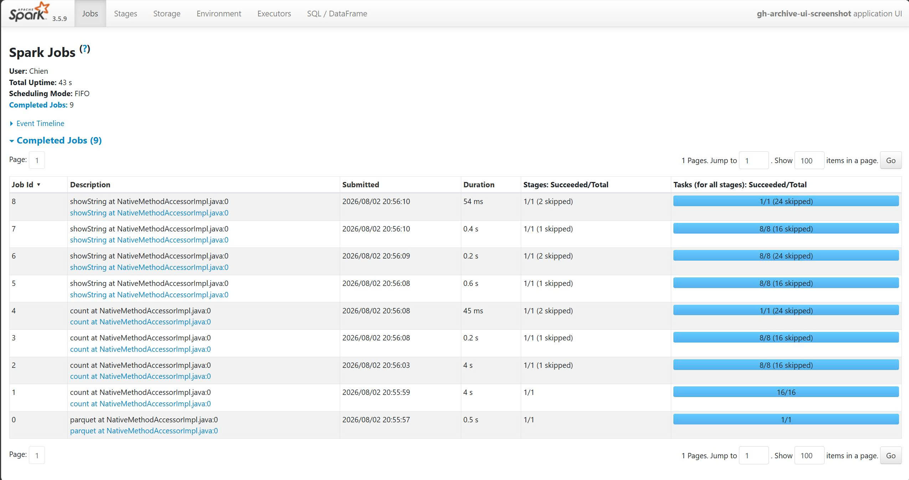
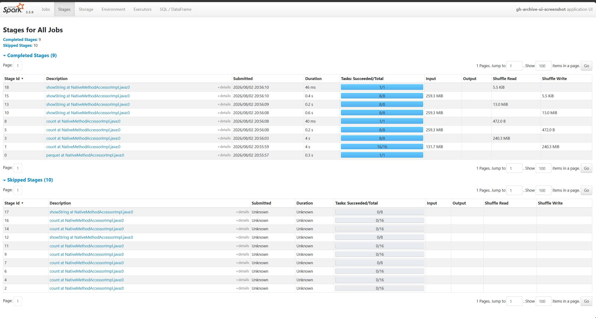

# GH Archive PySpark ETL

Dự án học PySpark bằng cách xử lý dữ liệu thật, đúng chỗ Spark thật sự cần
thiết: dữ liệu JSON lồng nhau, bán cấu trúc, và schema thay đổi tuỳ loại bản
ghi — thứ mà SQL warehouse truyền thống vật lộn còn Spark xử lý tự nhiên.

## Bài toán

Nguồn dữ liệu: [GH Archive](https://www.gharchive.org) — toàn bộ sự kiện
public của GitHub (push, PR, issue, star, fork...), mỗi giờ 1 file
`.json.gz`. Mỗi event có `payload` với schema khác nhau hoàn toàn tuỳ loại
event — khảo sát thật trên dữ liệu dự án (24h, 4,071,556 event) cho thấy
`spark.read.json()` suy luận ra một union schema **25 field top-level bên
trong `payload`**, hầu hết `NULL` tuỳ dòng (chi tiết: `docs/schema_notes.md`,
`docs/data_profiling.md`).

Mục tiêu: xây pipeline Bronze → Silver → Gold bằng PySpark **chạy local**
(không Databricks/cluster) — trọng tâm là hiểu **engine** (lazy evaluation,
transformation vs action, shuffle, partition, cache, data skew), không phải
hạ tầng triển khai.

## Trạng thái

- [x] Step 0 — Setup môi trường + SparkSession
- [x] Step 1 — Ingestion GH Archive
- [x] Step 2 — Khám phá nested schema (lazy evaluation)
- [x] Step 3 — Bronze (partition, transformation vs action)
- [x] Step 4 — Silver (flatten + explode)
- [x] Step 5 — Gold (aggregation + shuffle)
- [x] Step 6 — Tối ưu + hiểu engine (cache, partition, skew)
- [x] Step 7 — Portfolio polish (`quickstart.py`, `analysis/findings.py`,
      README này, screenshot Spark UI bên dưới)

## Spark UI

Chụp từ `spark/keep_ui_alive.py` (đọc Silver → `dropDuplicates` → `cache()` →
2 `groupBy` aggregation) — job thật của chính dự án này, không phải ảnh minh
hoạ chung chung.

**Tab Jobs** — 9 job hoàn thành, thấy rõ nhịp lazy evaluation: job đầu
(`parquet`) chỉ đọc Silver, các job `count`/`showString` sau đó là những
action riêng biệt gọi trên cùng 1 DataFrame `events` đã `.cache()`.



**Tab Stages** — cột **Shuffle Read**/**Shuffle Write** là bằng chứng trực
tiếp cho khái niệm shuffle ở Step 5/6: Stage 1 (`dropDuplicates` materialize
cache, 16 task) ghi ra 240.3 MiB shuffle write; Stage 3 (reduce sau shuffle,
đúng 8 task — khớp `spark.sql.shuffle.partitions=8`) đọc lại 240.3 MiB đó.
Các stage `groupBy` sau (5, 8, 10, 13...) đọc thẳng từ cache (259.3 MiB
Input, không phải đọc lại từ Parquet) với shuffle write rất nhỏ (472 B —
chỉ số đếm gộp, không phải dữ liệu thô).



## Kiến trúc

```
GH Archive (JSON.gz, mỗi giờ 1 file)
        │  ingestion/download_gharchive.py (Python thuần, idempotent + retry)
        ▼
   data/raw/          .json.gz thô, chưa đụng tới

        │  spark/bronze.py
        │  spark.read.json() → withColumn(event_date) → write.parquet()
        ▼
   data/bronze/        Parquet, partition theo event_date, GIỮ NGUYÊN union
        │               schema thô (không làm sạch/biến đổi nội dung)

        │  spark/silver.py
        │  flatten (actor.login→actor_login...) + explode_outer(payload.labels)
        │  + to_timestamp(created_at) + dropDuplicates(event_id) phòng thủ
        ▼
   data/silver/        Parquet, phẳng, grain = (event, label PR nếu có)

        │  spark/gold.py
        │  dropDuplicates(event_id) [khôi phục grain 1-event]
        │  groupBy(repo/hour/actor) → SHUFFLE
        ▼
   data/gold/           3 bảng: top_repos_by_stars, events_by_hour, top_actors

        │  analysis/findings.py (đọc-only, không Spark job nặng)
        ▼
   Findings              in ra console, xem mục "Findings" bên dưới
```

Mỗi layer là 1 thư mục Parquet riêng, không ghi đè lên nhau — cho phép truy
vết lại và tái chạy transform mà không cần tải lại dữ liệu gốc.

## Tech stack

| Thành phần | Công cụ |
|---|---|
| Compute engine | **PySpark 3.5.9** (local, `master("local[*]")`) |
| Storage | Parquet trên đĩa local, mỗi layer 1 thư mục |
| Ingestion | Python (`requests`), idempotent + retry |
| Windows write support | `winutils.exe`/`hadoop.dll` (Hadoop 3.3.6, community binary) |
| Orchestration | Không có (xem "Future work") — `quickstart.py` chỉ là wrapper subprocess đơn giản |

## Cách chạy

```bash
python -m venv venv
venv\Scripts\activate
pip install -r requirements.txt
```

Xem **"Setup Windows: winutils.exe"** bên dưới trước khi chạy bất kỳ script
nào ghi Parquet (Bronze/Silver/Gold).

**1 lệnh, end-to-end** (tải 1 ngày GH Archive → Bronze → Silver → Gold →
findings):

```bash
python quickstart.py                      # mặc định: tải ngày hôm qua (UTC)
python quickstart.py --skip-download       # dùng data/raw đã có sẵn
python quickstart.py --start 2026-08-01 --end 2026-08-01
```

Hoặc chạy tay từng bước để thấy rõ Spark UI/log của từng step riêng:

```bash
python spark/session.py                                    # Step 0: SparkSession, Spark UI
python ingestion/download_gharchive.py --start ... --end ...  # Step 1: tải GH Archive
python spark/explore_schema.py                              # Step 2: khám phá nested schema
python spark/bronze.py                                       # Step 3: Bronze (partition, action)
python spark/silver.py                                       # Step 4: Silver (flatten + explode)
python spark/gold.py                                         # Step 5: Gold (aggregation + shuffle)
python spark/optimize_demo.py                                # Step 6: cache, partition tuning, skew
python analysis/findings.py                                  # Step 7: findings trên Gold
```

## Setup Windows: winutils.exe

PySpark trên Windows đọc file thì không sao, nhưng **ghi** file (Parquet ở
Bronze/Silver/Gold) cần `winutils.exe` + `hadoop.dll` (Hadoop's native helper
cho Windows) — thiếu 2 file này `.write.parquet()` sẽ crash với
`UnsatisfiedLinkError`/`FileNotFoundException` khó đoán. Không cần trên
Linux/Mac.

Bundle Hadoop trong PySpark 3.5.9 là 3.3.4; dùng bản 3.3.6 (gần nhất có sẵn)
từ repo cộng đồng [cdarlint/winutils](https://github.com/cdarlint/winutils):

```bash
mkdir -p tools/hadoop/bin
curl -fSL -o tools/hadoop/bin/winutils.exe \
  "https://raw.githubusercontent.com/cdarlint/winutils/master/hadoop-3.3.6/bin/winutils.exe"
curl -fSL -o tools/hadoop/bin/hadoop.dll \
  "https://raw.githubusercontent.com/cdarlint/winutils/master/hadoop-3.3.6/bin/hadoop.dll"
```

`spark/session.py` tự động set `HADOOP_HOME`/`PATH` trỏ vào `tools/hadoop/`
nếu file tồn tại — không cần export biến môi trường thủ công, chỉ cần tải
file 1 lần. `tools/hadoop/` bị gitignore (binary bên thứ ba, không commit).

## Findings (số liệu thật, 24h dữ liệu — 2026-08-01, 4,071,556 event)

- **Top repo theo số sao trong ngày**: `firecrawl/pdf-inspector` (11 sao),
  `block/buzz` (5 sao) — số sao/ngày nhìn chung thấp, star là hành động
  hiếm hơn hẳn push/create so với tổng thể.
- **Hoạt động theo giờ khá đều**: giờ cao điểm 06h (178,686 event), thấp
  điểm 16h (166,179 event) — chênh lệch chỉ ~7.5%, phản ánh GitHub có
  người dùng/CI toàn cầu, không tập trung vào 1 múi giờ văn phòng.
- **`github-actions[bot]` áp đảo**: 227,280 event/ngày (5.58% tổng số event
  toàn ngày) — nhiều hơn actor active thứ 2 (`dependabot[bot]`, 23,248 event)
  gần **10 lần**. Đây là ví dụ **data skew thật** dùng để minh hoạ shuffle
  không cân bằng ở Step 5/6 (`docs/spark_concepts.md`).
- **Top actor không mang mác `[bot]`** (`ugmoddev`, `zerotraceh1`,
  `r00tsh00t12345`...) vẫn có tên dạng chuỗi ngẫu nhiên — nhiều khả năng là
  script/bot tự động không tuân theo quy ước đặt tên GitHub Apps, không nên
  coi là "top contributor con người" nếu chưa xác minh thêm.
- **`PushEvent` chiếm 95.65%** tổng số event cả ngày (3,894,278/4,071,556) —
  bất kỳ phân tích "hoạt động repo" nào cũng gần như phản ánh push activity,
  không phải star/fork.
- **`payload.commits` không tồn tại** trong dữ liệu GH Archive hiện tại (kế
  hoạch ban đầu dùng nó để dạy `explode()` đã phải đổi hướng — xem
  `docs/data_profiling.md` §4.1) — bài học thực tế rằng schema của 1 nguồn
  dữ liệu bên ngoài có thể đổi theo thời gian, không nên hardcode field
  name mà không verify trước.

Chi tiết đầy đủ + cách tái tạo: `analysis/findings.py`.

## Điều tôi học được về Spark

- **Lazy evaluation**: `read.json()`, `select()`, `withColumn()`,
  `.cache()` đều là transformation — chỉ khai báo kế hoạch, không chạm dữ
  liệu. `.show()`, `.count()`, `.write.parquet()` là action — action mới là
  lúc Spark thật sự chạy. Không cache, mỗi action lặp lại toàn bộ chuỗi từ
  đầu (đo được: 2 action liên tiếp không cache tốn ~3.5s + ~2s; có cache,
  action thứ 2 chỉ còn 0.34s).
- **Shuffle**: `groupBy`, `orderBy`, `dropDuplicates`, `join` là *wide*
  transformation — cần di chuyển dữ liệu giữa các partition. `filter`,
  `select`, `withColumn` là *narrow* — tính gọn trong 1 partition, không
  cần di chuyển gì. Đây là ranh giới rẻ/đắt quan trọng nhất khi tối ưu
  Spark.
- **Partition & `spark.sql.shuffle.partitions`**: mặc định 200 (thiết kế
  cho cluster lớn) tạo overhead trên dữ liệu nhỏ chạy local — đo được 200
  partition chậm hơn ~2x so với 8 partition trên cùng 1 `groupBy`, cùng dữ
  liệu.
- **Data skew là thuộc tính của dữ liệu, không phải của `groupBy`**: hash
  partitioning chia đều SỐ KEY vào các partition, không chia đều SỐ DÒNG
  đằng sau mỗi key. `github-actions[bot]` (227K dòng) dồn hết vào 1
  partition trong khi các partition khác có tổng dòng thấp hơn hẳn — thấy
  trực tiếp bằng `F.spark_partition_id()`, không chỉ lý thuyết suông.
- **`explode()` vs `explode_outer()`**: khác biệt sống còn khi mảng có thể
  NULL cho phần lớn dòng (như `payload.labels`, chỉ có ở `PullRequestEvent`)
  — dùng nhầm `explode()` sẽ âm thầm xoá mọi dòng không có mảng.
- **Schema-on-read của JSON là union tất cả record đã thấy**, không phải
  schema "đúng" cho 1 loại bản ghi cụ thể — nguồn dữ liệu ngoài (GH Archive)
  có thể đổi field theo thời gian mà không báo trước; luôn profiling dữ
  liệu thật trước khi hardcode tên field vào code transform.

## Future work

- Đưa lên cluster thật (Databricks Free Edition / EMR) để chạy quy mô năm.
- Streaming: đọc GH Archive gần real-time bằng Spark Structured Streaming.
- Thêm orchestration thật (Airflow/Dagster) thay cho `quickstart.py`
  (hiện chỉ là subprocess wrapper, không có retry/scheduling).
- Delta/Iceberg thay Parquet thô để có ACID + time travel.
- Xử lý data skew bằng salting key hoặc Adaptive Query Execution (AQE)
  skew-join handling — đã thấy skew thật ở `github-actions[bot]` nhưng
  chưa áp dụng kỹ thuật xử lý (nằm ngoài phạm vi demo local quy mô này).
